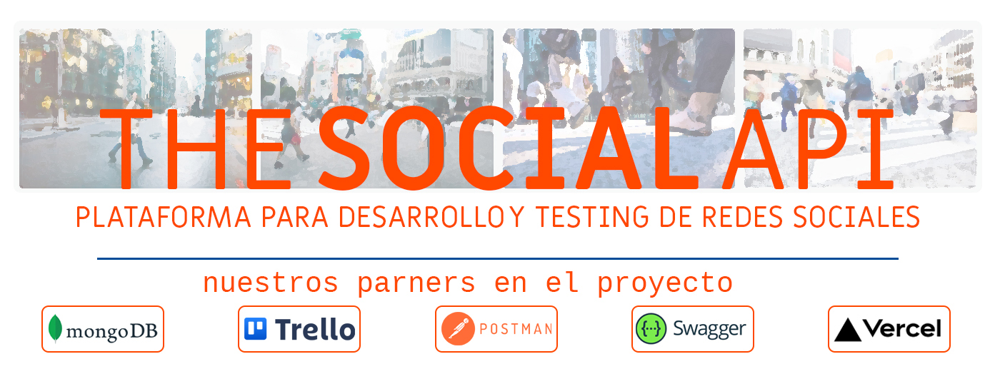

# ÍNDICE
- [THESOCIALAPI](#trello-)
    - [Descripción del proyecto](#vista-tablero)

- [TRELLO](#trello-)
    - [Enlace al tablero de trabajo ONLINE del proyecto](#vista-tablero)
    - [Bloques de tareas y código visual](#vista-tablero)
    - [Vista general de tareas](#vista-lista)

- [POSTMAN](#trello-)
    - [Enlace a la documentación y testing de la API online](#vista-tablero)
    - [Estructura de endpoints creados y testeados](#vista-tablero)

- [SWAGGER](#mongodb-investigación)
    - [Estructura de carpetas y check de instalación de la dependencia](#qué-es-mongodb)
 
- [MONGODB Atlas](#trello-)
    - [Vista del CLÚSTER que contiene la base de datos que nutre THESOCIALAPI](#vista-tablero)
    - [Estructura de endpoints creados y testeados](#vista-tablero)
    - [Vista general de tareas](#vista-lista)

- [Herramientas empleadas en el proyecto (TOOLSET) ](#authors-)

- [Authores](#authors-)

# THESOCIALAPI 📅
## Descripción del proyecto
[⬆️](#índice)

>*Vista general del tablero creado para el proyecto THESOCIALAPI.*

# TRELLO 📅
## Bloques de tareas y código visual
[⬆️](#índice)

>*Vista general del tablero creado para el proyecto THESOCIALAPI.*

## Vista lista
[⬆️](#índice)

>*Vista general del tablero que contiene todas las tarjetas del proyecto THESOCIALAPI.*

***
# POSTMAN
## Enlace a la documentación y testing de la API online
[⬆️](#índice)
>[Ir a POSTMAN](https://documenter.getpostman.com/view/26580726/2s93eSZvCJ)

## Estructura de endpoints creados y testeados
[⬆️](#índice)

# SWAGGER
## Estructura de carpetas y check de dependencia
[⬆️](#índice)

>Vista de la estructura de carpetas necesaria al instalar la dependencia que vincula el código con la plataforma de SWAGGER.

## ¿Ventajas de MONGODB respecto otras bases de datos relacionales?
[⬆️](#índice)
>MongoDB ofrece varias ventajas en comparación con las bases de datos relacionales, especialmente en escenarios donde se requiere flexibilidad en la estructura de los datos y alta escalabilidad. Algunas de las ventajas principales de MongoDB son las siguientes:

## ¿Desventajas de MongoDB? ¿Cuando no es recomendable utilizarlo?
[⬆️](#índice)

>Aunque MongoDB ofrece muchas ventajas, también tiene algunas limitaciones y desventajas que es importante tener en cuenta al considerar su uso en un proyecto. Algunas de las desventajas de MongoDB son las siguientes:

## Instalación y configuración de MONGODB y requisitos mínimos de hardware y software.
[⬆️](#índice)

>La instalación y configuración de MongoDB puede variar según el sistema operativo en el que se desee instalar. A continuación se proporcionan los pasos generales para la instalación en un entorno típico de Windows, Linux o macOS:

> __Note__
Powered by BLADGPT

## Herramientas empleadas en el proyecto (TOOLSET) ⚙️
[⬆️](#índice)

>* [*TRELLO*](https://trello.com/) - Planificador de tareas (Versión: no disponible)
>* [*POSTMAN*](https://www.postman.com/) - Software para probar y documentar endpoints (Versión: 10.13.5)
>* [*SWAGGER*](https://swagger.io/) - Plataforma de documentación de API's (Versión: 4.6.2)
>* [*VISUAL STUDIO CODE*](https://code.visualstudio.com/) - Editor de código (Versión: 1.75.1)
>* [*NodeJS*](https://code.visualstudio.com/) - Entorno de ejecución para crear servidores en backend (Versión: 18.15.0)
>* [*Nodemon*](https://www.npmjs.com/package/nodemon/) - Herramienta para desarrollo que levanta el servidor automáticamente tras cada cambio realizado en el código (Versión: 18.15.0)
>* [*MONGODB*](https://www.mongodb.com//) - Gestor de base de datos (Versión: 6.0)
>* [*MONGOOSE*](https://mongoosejs.com/) - Herramienta de modelado de objetos para Node Js (Versión: 7.0.4)
>* [*ATLAS (MONGODB)*](https://cloud.mongodb.com/) - Alojamiento de MONGODB para la/s base/s de datos empleando clústers (Versión: 6.0)
>* [*BCRYPT*](https://code.visualstudio.com/) - Dependencia para la encriptación y comprobación de contraseñas (Versión: 1.4.3)
>* [*JASON WEB TOKEN*](https://code.visualstudio.com/) - Dependencia para generar tokens de acceso (Versión: 9.0.0)
>* [*DOTENV*](https://code.visualstudio.com/) - Dependencia para establecer las variables globales y poder desplegar (Versión: 16.0.3)
>* [*VERCEL*](https://code.visualstudio.com/) - Plataforma para el despliegue del servidor(Versión: 1.75.1)
>* [*Live Server*](https://marketplace.visualstudio.com/items?itemName=ritwickdey.LiveServer) -Extension de Visual Studio para check durante la fase de desarrollo y en entorno local.

## Authores ✒️
[⬆️](#índice)

**José LLanas** - | *Coding* | - [jllanas1986](https://github.com/jllanas1986)

**Joan Baldó** - | *Coding* | - [joanbaldo](https://github.com/joanbaldo)

***
